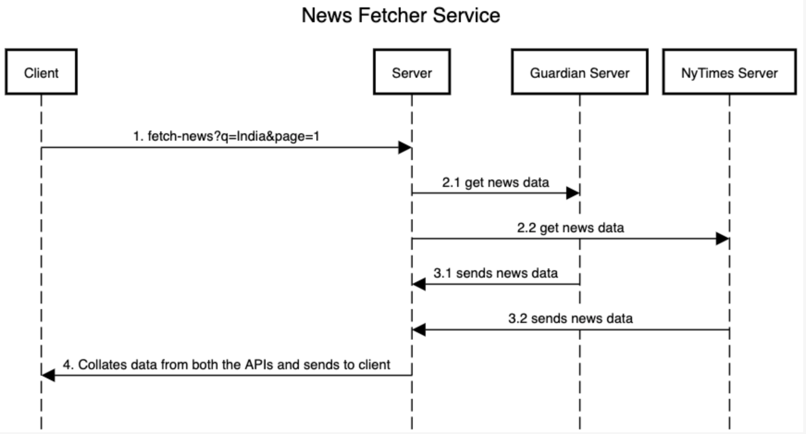

## News Fetcher

## Setup
- Install Golang : Version go1.22.0
- Git pull - to say

### Build
- Build the code , run

## Config
- All config is in file
```
settings/config.json
```
- Please make sure this folder has read/write permissions

## Coding guidelines
- Run go fmt before checking in code
- Build runs go vet : please dont ignore these errors

### Create Docker Containers
- docker build -t news-sharing .
- docker run -p 8080:8080 news-sharing
- Hit the URL `localhost/ping` in the browser, You should get a response `pong`

## Sequence Diagram

